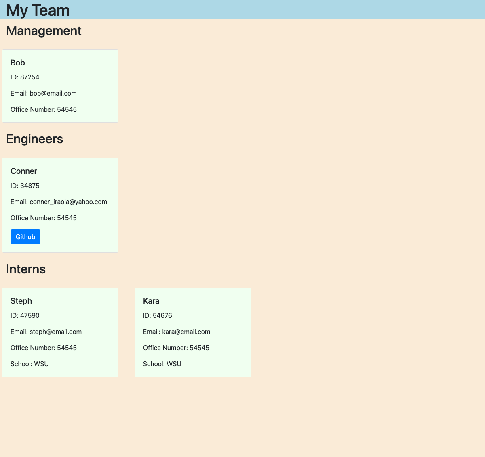

# Team_Profile_Generator
https://github.com/conneriraola/Team_Profile_Generator

# Description
Task is to build a Node.js command-line application that takes in information about employees on a software engineering team, then generates an HTML webpage that displays summaries for each person.

# Table of Contents
* [Installation](#installation)
* [Usage](#usage)
* [License](#license)
* [Screenshot](#screenshot)
* [Testing](#testing)
* [Screenshot](#screenshot)
* [Video](#video)
* [Questions](#questions)
    
# Installation 
The following dependencies must be installed to run application: 
node.js, inquirer, jest

# Usage
Instructions to use app... 
Run node index in your terminal to be prompted a series of questions. Once finished, an html file will be generated in the ./dist folder.

# License
MIT
(https://opensource.org/licenses/MIT)

# Testing
To run tests enter "npm t" in terminal

# Screenshot

# Video
https://drive.google.com/file/d/1Z4XNFma2ONR8DK7R826gpXrGFP5yGLBo/view?usp=sharing

# Questions
* Github Username: conneriraola
* Github profile: https://github.com/conneriraola
* conner_iraola@yahoo.com

